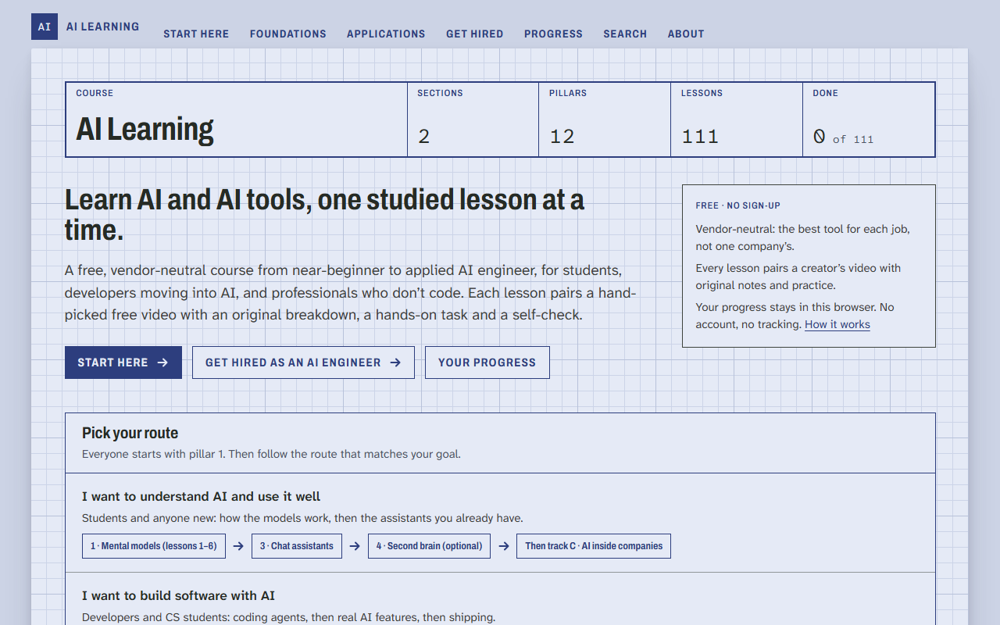
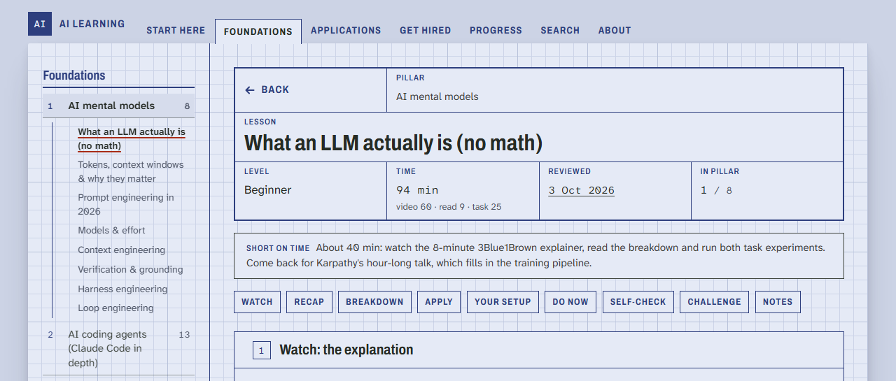
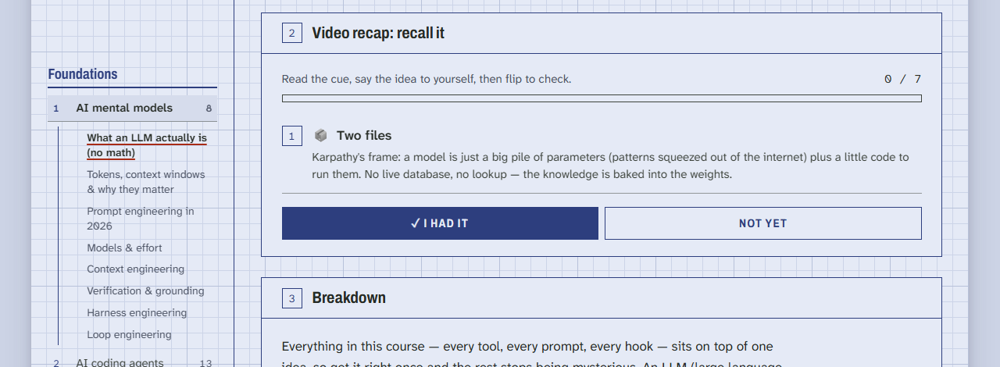
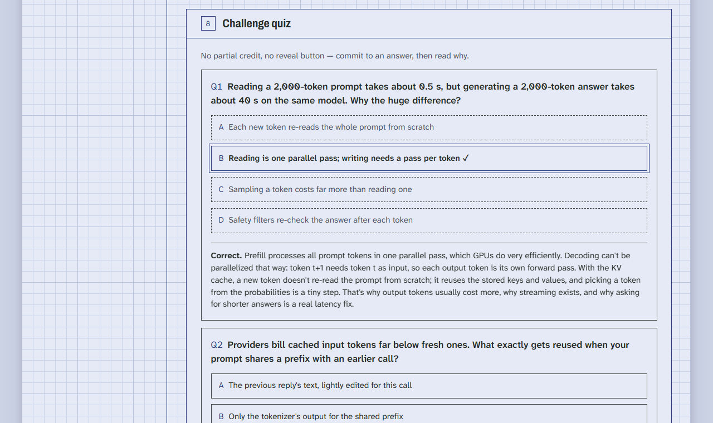
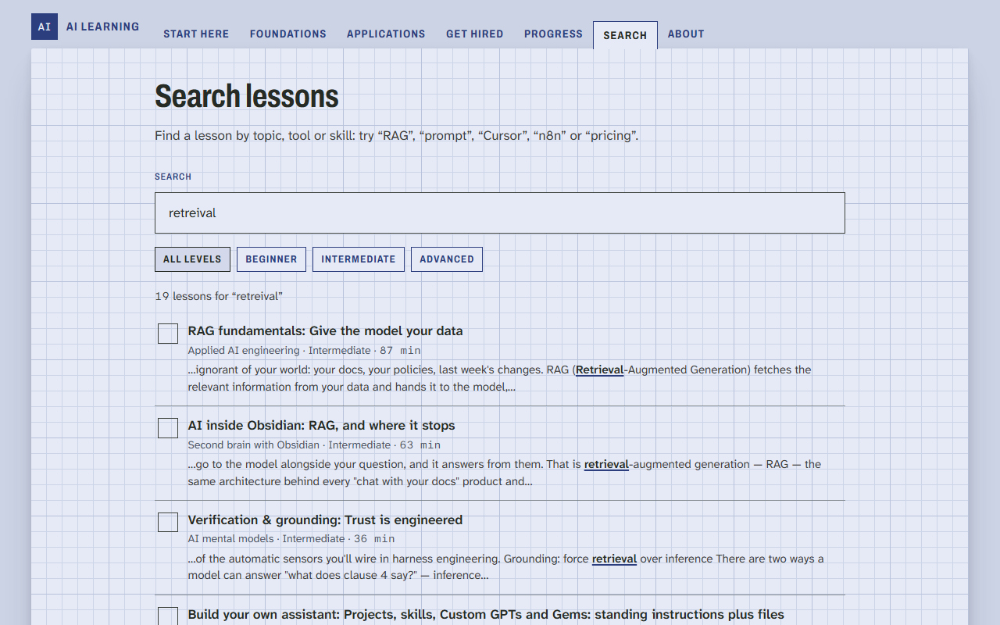
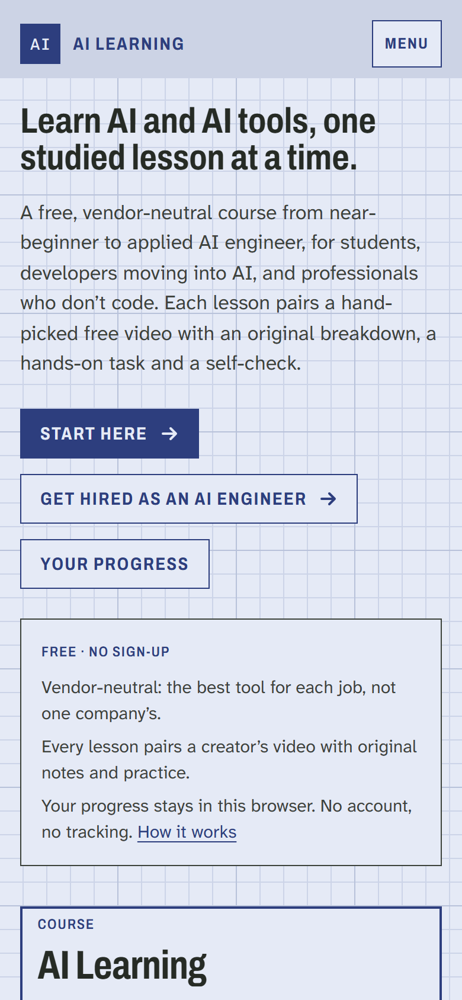
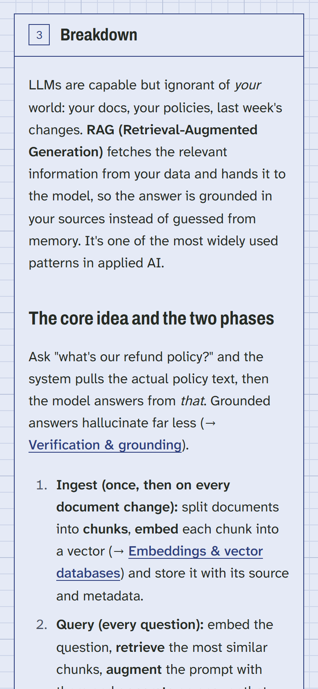

# AI Learning

[](https://github.com/seifyounes/ai-learning-website-public-edition/actions/workflows/check.yml)

**A free, vendor-neutral course that takes you from near-beginner to applied AI engineer.**
111 lessons across 12 pillars. Each lesson pairs a hand-picked free video with original notes, a
recall recap, a hands-on task and a self-check. There's no sign-up, and your progress stays in
your browser.



## Who it's for

- **Students** new to AI who want to understand how the models work, then use them well.
- **Developers** moving into AI engineering: coding agents, APIs, RAG, agents, evals, shipping.
- **Professionals who don't code** who want AI to do real work in their job.

Each group gets its own route through the course, and the site orders the lessons for that goal.

## What's inside

- **Foundations (8 pillars):** AI mental models · AI coding agents (Claude Code in depth) ·
  chat assistants · a second brain with Obsidian · automated workflows and agents · applied AI
  engineering (APIs, RAG, embeddings, agents, MCP, evals, cost, security) · shipping real apps ·
  the math and ML core.
- **Applications (4 tracks):** marketing and content · building products · AI inside
  companies · agency and freelance services.
- **Every lesson has the same shape:** the video and why it was picked → a recap you recall
  before flipping each card → an original breakdown with a worked example and common failure
  modes → *Apply it to your work* → *Upgrade your AI setup* → a hands-on task → scenario
  self-checks and, in 51 lessons, a scored challenge quiz → your notes. The header splits the
  time into video, reading and task, lists the lessons to do first, and offers a 40-minute
  short path through the long ones.

| Lesson header | Recall recap |
|---|---|
|  |  |
| **Challenge quiz** | **Search** |
|  |  |

<p>
  
  &nbsp;
  
</p>

## Features

- **Routes by goal:** Start Here, three goal routes, and a *Your Path* page that orders the
  Applications tracks for the goal you pick and remembers it.
- **Search:** full-text, built at compile time and loaded on first use, with light stemming,
  one-typo tolerance (including swapped letters), level filters and state kept in the URL.
- **Practice that commits you to an answer:** recap cards you recall before flipping (with a
  replay of the ones you missed), self-checks graded *I got it / I missed it*, and challenge
  quizzes that lock your pick before explaining it.
- **Progress without an account:** completion, notes, quiz scores, streaks, XP, ranks and
  badges, all in `localStorage`. You can export, import (with a confirmation and a one-step
  undo) and erase them.
- **Get Hired:** a job-readiness roadmap for the Applied AI Engineer role, with a fast-track
  lesson list, portfolio and interview checklists, and a readiness score.
- **Built to be shared and found:** per-lesson Open Graph images, canonical URLs, a sitemap, and
  `LearningResource` + `VideoObject` structured data.

## Engineering

- **Next.js 15 App Router, fully static.** 252 pages are prerendered; unknown URLs return a
  real 404. There's no backend, database, cookies or analytics. YouTube loads only when a
  learner presses play, from `youtube-nocookie.com`.
- **Content as data.** One lesson is one `.mdx` file with typed YAML frontmatter. Adding a lesson
  needs no code: it appears in its pillar, the sidebar, search, the sitemap and progress.
- **Quality gates in CI.** Every push runs typecheck, lint, a content gate and a production
  build. The content gate (`scripts/check-public.js`) enforces the lesson schema and catches
  unclickable raw slugs, guessable quiz answers (the right option can't be the longest),
  unverifiable superlatives, diagrams too wide for a 320px phone and long lessons without a
  short path. A weekly job (`scripts/check-links.js`) re-checks every video through YouTube
  oEmbed and every external link, so a video that goes private is caught even when nothing in
  the repo changed.
- **Accessible by default.** Skip link, labelled landmarks, one H1 per page,
  `aria-expanded`/`aria-pressed`/live regions on every interactive block, visible focus,
  reduced-motion support, nothing under 12px, and text contrast of at least 4.5:1, including on
  tinted panels. No page scrolls sideways at 320px.

## Design

The interface is **the Computation Pad**: each page is a sheet of grid paper on a desk. Ruled
title blocks and printed buttons are set in condensed Archivo, prose in Atkinson Hyperlegible,
and every quantity in Atkinson Hyperlegible Mono. A single red pen marks corrections, answers
and the "you stopped here" note. It's light only, uses square forms and drawn marks, and stays
readable down to 320px. Tokens live in `src/app/globals.css`; the shared pieces (title block,
gauges, ticks, arrows) are in `src/components/TitleBlock.tsx`.

## Independent review

Before release, an independent reviewer agent rated the whole site against an 11-criterion
rubric (`docs/review/RUBRIC.md`): content, relevance, learning design, onboarding, navigation,
interactivity, visual design, mobile, accessibility, trust and technical quality. Each round's
fixes were applied and the site was re-reviewed until every criterion reached 9 out of 10.

| Round | 1 | 2 | 3 | 4 | 5 | 6 | 7 | 8 |
|---|---|---|---|---|---|---|---|---|
| Overall | 7.7 | 8.45 | 8.9 | 8.85 | 9.1 | 9.08 | 8.95 | **9.1** |
| Lowest criterion | 7.0 | 7.8 | 8.4 | 8.4 | 8.8 | 8.8 | 8.5 | **9.0** |

Every round's scores, evidence and fixes are in `docs/review/round-*.json`. The optional
polish suggested in round 8 has since been applied too.

## Run it

```bash
npm ci
npm run dev
```

Then open http://localhost:3000.

| Command | What it does |
|---|---|
| `npm run typecheck` | TypeScript, no emit |
| `npm run lint` | ESLint (Next.js rules) |
| `npm run check` | The content gate over every lesson |
| `npm run check:links` | Every video and external link (needs network) |
| `npm run build` | The production build |

## Project layout

```
content/<section>/<pillar>/<lesson>.mdx   one lesson per file: YAML frontmatter + markdown
src/app/                                  routes: home, sections, pillars, lessons, search, …
src/components/                           lesson blocks, quizzes, recap, progress, navigation
src/lib/                                  content loader, curriculum, routes, progress, search
scripts/                                  content gate and link checker
docs/                                     voice guide, review rubric and review rounds
```

## Deploy (Vercel)

Import the repo into Vercel with the defaults (framework: Next.js). Both environment variables
are optional:

| Variable | Default | Used for |
|---|---|---|
| `NEXT_PUBLIC_SITE_URL` | the project's Vercel production domain | canonical links, share cards, sitemap, robots |
| `NEXT_PUBLIC_REPO_URL` | `https://github.com/seifyounes/ai-learning-website-public-edition` | "Report it on GitHub" links and the footer |

## How it was made

The lessons were researched and drafted with AI assistance, then checked against the sources
each one links. A video becomes a lesson's primary only after it has been compared with the
alternatives for accuracy, clarity, recency and the creator's track record, and each lesson
says why it was picked and what has aged. The site was built with AI coding agents, with every
change held to the checks above.

Found a mistake, a dead link or something out of date? Every lesson has a **Report it on
GitHub** link that opens an issue with the page filled in.

## Credits

Videos are embedded from YouTube and belong to their creators. Each lesson names the channel and
links further reading from the original publishers. Fonts: Archivo and Atkinson Hyperlegible
(SIL Open Font License).

Designed and built by **Seif Younes**.
